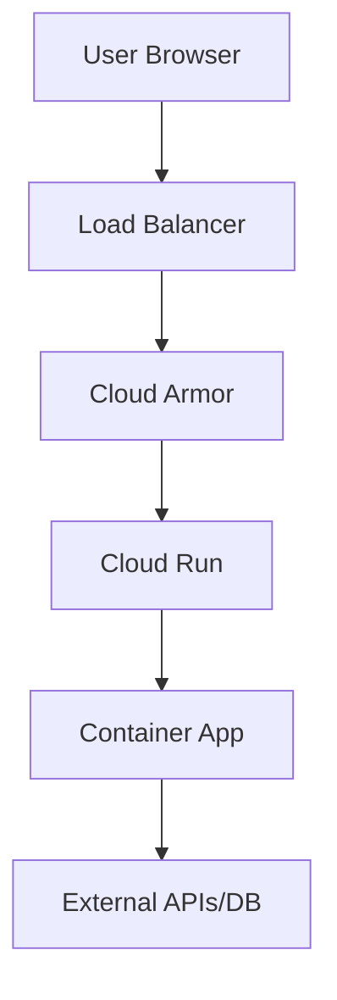
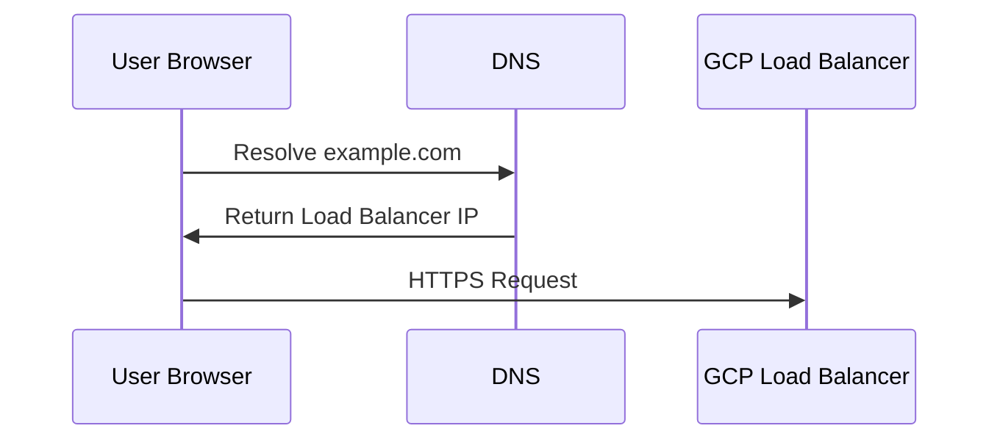
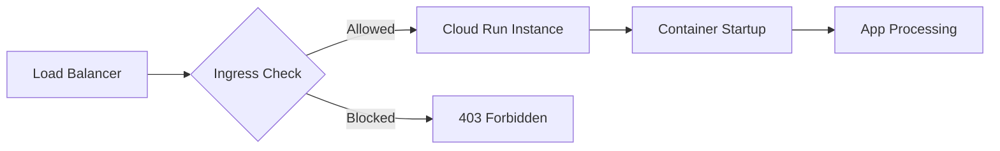
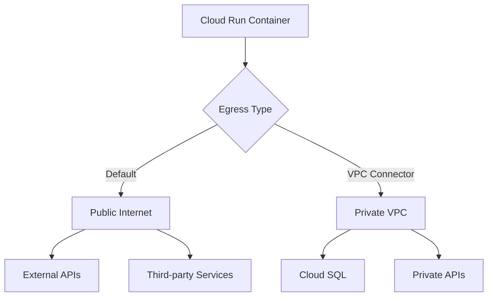
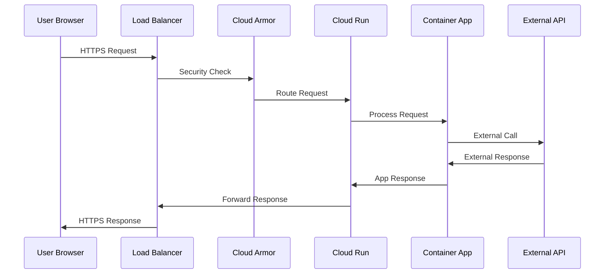
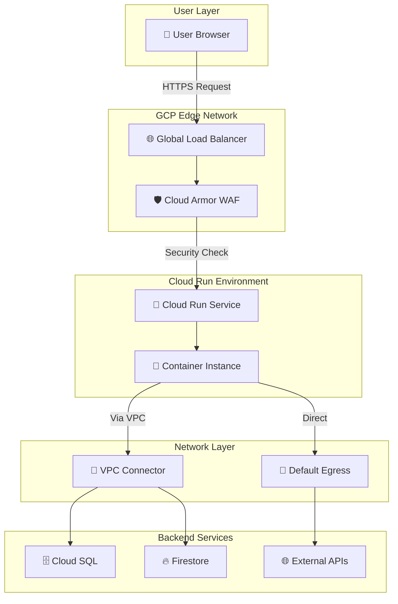

# How GCP Cloud Run Request Flow Works

A comprehensive guide to understanding request flow through Google Cloud Platform

<div class="pt-12">
  <span @click="$slidev.nav.next" class="px-2 py-1 rounded cursor-pointer" hover="bg-white bg-opacity-10">
    Let's explore the journey of a request <carbon:arrow-right class="inline"/>
  </span>
</div>

---
layout: default
---

# Overview

Understanding the complete request flow through GCP components:

<v-clicks>

- 🛡️ **Cloud Armor** - Security Layer & WAF
- ⚖️ **Load Balancer** - HTTP/HTTPS traffic distribution
- 🚀 **Cloud Run** - Fully managed serverless containers
- 📥 **Ingress** - Incoming traffic management
- 📤 **Egress** - Outgoing traffic handling

</v-clicks>

<div class="mt-8">
<v-click>



</v-click>
</div>

---
layout: two-cols
---

# Step 1: User Makes a Request

When a user navigates to your application:

<v-clicks>

- 🌐 Browser performs DNS lookup
- 🔗 Resolves to GCP's Global Load Balancer
- 📱 Initiates HTTPS request to `https://example.com`
- ⚡ Request travels to GCP's edge network

</v-clicks>

::right::

<div class="mt-8">

```javascript
// User action in browser
window.location.href = 'https://example.com'

// DNS Resolution
example.com → GCP Load Balancer IP
```

<v-click>



</v-click>

</div>

---
layout: default
---

# Step 2: Load Balancer + Cloud Armor

<div class="grid grid-cols-2 gap-8">

<div>

## Load Balancer Features
<v-clicks>

- 🌍 **Global distribution** - Edge locations worldwide
- 🔒 **SSL/TLS termination** - Handles encryption at edge
- 🎯 **Host/Path routing** - Routes based on URL patterns
- ⚖️ **Load distribution** - Balances across backends

</v-clicks>

</div>

<div>

## Cloud Armor Security
<v-clicks>

- 🛡️ **WAF Protection** - Web Application Firewall
- 🚫 **IP/Geo blocking** - Location-based filtering  
- 📊 **Rate limiting** - Prevents abuse
- 🔍 **Layer 7 rules** - Deep packet inspection
- 🛑 **DDoS protection** - Automatic mitigation

</v-clicks>

</div>

</div>

<v-click>

```yaml
# Cloud Armor Security Policy Example
securityPolicy:
  rules:
    - priority: 1000
      match:
        versionedExpr: SRC_IPS_V1
        config:
          srcIpRanges: ["192.0.2.0/24"]
      action: "deny(403)"
    - priority: 2000  
      match:
        expr:
          expression: "origin.region_code == 'CN'"
      action: "deny(403)"
```

</v-click>

---
layout: default
---

# Step 3: Cloud Run Ingress

<div class="grid grid-cols-2 gap-8">

<div>

## Ingress Configuration
<v-clicks>

- 🌐 **All traffic** - Public access
- 🏢 **Internal only** - VPC access only  
- ⚖️ **Internal + Load Balancer** - Hybrid access
- 🔐 **IAM authentication** - Identity-based access

</v-clicks>

## Auto-scaling Features
<v-clicks>

- 📉 **Scale to zero** - No idle costs
- 📈 **Auto-scaling** - Based on request volume
- ⚡ **Cold start optimization** - Fast container startup
- 🔄 **Concurrency control** - Requests per instance

</v-clicks>

</div>

<div>

```yaml
# Cloud Run Service Configuration
service:
  metadata:
    annotations:
      run.googleapis.com/ingress: all
      run.googleapis.com/ingress-status: all
  spec:
    template:
      metadata:
        annotations:
          autoscaling.knative.dev/maxScale: "100"
          autoscaling.knative.dev/minScale: "0"
          run.googleapis.com/cpu-throttling: "false"
      spec:
        containerConcurrency: 80
        timeoutSeconds: 300
```

<v-click>



</v-click>

</div>

</div>

---
layout: default
---

# Step 4: Container Processing

Your application handles the request within the Cloud Run container:

<v-clicks>

- 🐳 **Container startup** - If no warm instances available
- 🔧 **Request processing** - Your app logic executes
- 💾 **Database queries** - Connect to Cloud SQL, Firestore, etc.
- 🌐 **External API calls** - Third-party service integration
- 📝 **Response generation** - Prepare data for client

</v-clicks>

<div class="mt-4">

```javascript
// Example Express.js app in Cloud Run
const express = require('express');
const app = express();

app.get('/', async (req, res) => {
  // Your app logic here
  const data = await fetchFromDatabase();
  const externalData = await callExternalAPI();
  
  res.json({
    message: 'Hello from Cloud Run!',
    data: data,
    external: externalData
  });
});

const port = process.env.PORT || 8080;
app.listen(port, () => {
  console.log(`Server running on port ${port}`);
});
```

</div>

---
layout: default
---

# Step 5: Egress (Outbound Requests)

When your container needs to make external requests:

<div class="grid grid-cols-2 gap-8">

<div>

## Default Egress
<v-clicks>

- 🌐 **Direct internet access** - Default behavior
- 📡 **Public IP routing** - Through GCP's network
- 🔒 **HTTPS/TLS** - Encrypted connections
- 📊 **Billing applies** - For outbound traffic

</v-clicks>

## VPC Connector Egress
<v-clicks>

- 🏗️ **VPC integration** - Private network access
- 🗄️ **Cloud SQL access** - Private IP connections
- 🔐 **Private APIs** - Internal service calls
- 🎛️ **Traffic control** - Route specific traffic

</v-clicks>

</div>

<div>

```yaml
# VPC Connector Configuration
apiVersion: serving.knative.dev/v1
kind: Service
metadata:
  annotations:
    run.googleapis.com/vpc-access-connector: projects/PROJECT/locations/REGION/connectors/CONNECTOR
    run.googleapis.com/vpc-access-egress: private-ranges-only
spec:
  template:
    metadata:
      annotations:
        run.googleapis.com/vpc-access-connector: CONNECTOR
```

<v-click>



</v-click>

</div>

</div>

---
layout: default
---

# Step 6: Response Flow

The response travels back through the same path:

<v-clicks>

1. 📤 **Container response** - Your app returns data
2. 🚀 **Cloud Run processing** - Response headers added
3. ⚖️ **Load Balancer forwarding** - Routes back to client
4. 🔒 **TLS encryption** - Response encrypted at edge
5. 🌐 **Client delivery** - Browser receives response

</v-clicks>

<div class="mt-6">



</div>

---
layout: default
---

# Complete Architecture Diagram

<div class="flex justify-center">



</div>

---
layout: default
---

# Key Benefits & Features

<div class="grid grid-cols-2 gap-8">

<div>

## 🚀 Performance
<v-clicks>

- **Global edge network** - Low latency worldwide
- **Auto-scaling** - Handle traffic spikes
- **Scale to zero** - No idle costs
- **Fast cold starts** - Optimized container startup

</v-clicks>

## 🛡️ Security
<v-clicks>

- **Cloud Armor WAF** - Comprehensive protection
- **IAM integration** - Fine-grained access control
- **VPC connectivity** - Private network access
- **TLS termination** - End-to-end encryption

</v-clicks>

</div>

<div>

## 💰 Cost Optimization
<v-clicks>

- **Pay per request** - No idle charges
- **Efficient resource usage** - Automatic optimization
- **Global load balancing** - Optimal resource allocation

</v-clicks>

## 📊 Observability
<v-clicks>

- **Cloud Logging** - Comprehensive request logs
- **Cloud Monitoring** - Performance metrics
- **Cloud Trace** - Request tracing
- **Error Reporting** - Automatic error detection

</v-clicks>

</div>

</div>

---
layout: default
---

# Best Practices

<v-clicks>

## 🏗️ Architecture
- Use VPC connectors for private resources
- Implement proper health checks
- Configure appropriate concurrency limits
- Set up monitoring and alerting

## 🛡️ Security  
- Configure Cloud Armor security policies
- Use IAM for authentication when needed
- Implement proper CORS policies
- Regular security audits

## 📈 Performance
- Optimize container image size
- Use connection pooling for databases
- Implement caching strategies
- Monitor and optimize cold start times

## 💸 Cost Management
- Set appropriate scaling limits
- Use minimum instances for critical services
- Monitor egress costs
- Implement request/response compression

</v-clicks>

---
layout: center
class: text-center
---

# Thank You!

Understanding GCP Cloud Run request flow helps you build better, more secure, and cost-effective applications.

<div class="pt-12">
  <span class="px-2 py-1 rounded cursor-pointer" hover="bg-white bg-opacity-10">
    Questions? 🤔
  </span>
</div>

---
layout: default
---

# Additional Resources

<v-clicks>

- 📚 **Official Documentation**
  - [Cloud Run Documentation](https://cloud.google.com/run/docs)
  - [Cloud Armor Documentation](https://cloud.google.com/armor/docs)
  - [Load Balancer Documentation](https://cloud.google.com/load-balancing/docs)

- 🛠️ **Tools & Examples**
  - [Cloud Run Samples](https://github.com/GoogleCloudPlatform/cloud-run-samples)
  - [Terraform GCP Modules](https://registry.terraform.io/providers/hashicorp/google/latest)

- 🎓 **Learning Resources**
  - [Google Cloud Skills Boost](https://www.cloudskillsboost.google/)
  - [Cloud Architecture Center](https://cloud.google.com/architecture)

</v-clicks>
